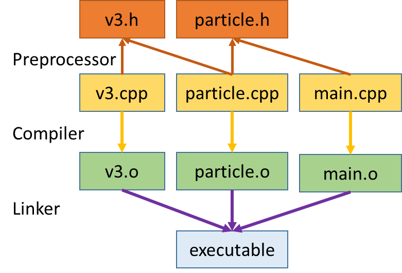

# Visão Geral da Linguagem C/C++

## Compilação

```C++
//HelloWorld.cpp
#include <iostream>
int main() {
  std::cout << "Hello World" << std::endl;
}
``` 

### Processo de Compilação
```
g++ -Wall HelloWorld.cpp -o main
./main 
```

### MakeFile

```makefile
#name of project
PROJ_NAME=main
#src files
SRC_FILES=$(wildcard *.cpp)
OBJ_FILES=$(SRC_FILES:.cpp=.o)
# compilador
CC=g++

all : $(PROJ_NAME)

$(PROJ_NAME): $(OBJ_FILES)
	@ echo 'Building target using g++ linker: $@'
	$(CC)  -o $@ $^ -Wall -g -fsanitize=address
	@ echo 'Finished building binary: $@'

%.o : %.cpp 
	@ echo 'Building object files using g++ linker: $@'
	$(CC)   -c  $< -o $@ -Wall -g -fsanitize=address
	@ echo 'Finished building object file: $@'

clean: 
	rm *.o $(PROJ_NAME)
```

### Usando makefile
```
$ make
Building object files using g++ linker: HelloWorld.o
g++   -c  HelloWorld.cpp -o HelloWorld.o -Wall -g -fsanitize=address
Finished building object file: HelloWorld.o
Building target using g++ linker: main
g++  -o main HelloWorld.o -Wall -g -fsanitize=address
Finished building binary: main
$ ./main
Hello World
```

### Processo de compilação de múltiplos arquivos 


## Tipos de Dados e Modificadores

```C++
#include <iostream>
#include <limits.h>
#include <float.h>
using namespace std;

int main(){

    char a;
    int b;
    long c;
    bool d;
    float e;
    double f;


    cout << "char size " << sizeof(char) << endl;
    cout << "int size " << sizeof(int) << endl;
    cout << "long size " << sizeof(long) << endl;
    cout << "bool size " << sizeof(bool) << endl;
    cout << "float size " << sizeof(float) << endl;
    cout << "double size " << sizeof(double) << endl;

    cout << "limites int [ " << INT_MIN << "," << INT_MAX << "]" << endl;
    cout << "limites long [ " << LONG_MIN << "," << LONG_MAX << "]" << endl;
    cout << "limites float [ " << FLT_MIN << "," << FLT_MAX << "]" << endl;
    cout << "limites double [ " << DBL_MIN << "," << DBL_MAX << "]" << endl;


    /*Difference between 1 and the least value greater than 1 that is representable.*/
    cout << "float epsilon " << FLT_EPSILON << endl;
    cout << "double epsilon " << DBL_EPSILON << endl;


    
    /*Modifificadores*/
    unsigned int g;
    unsigned long h;
    long double i;


    cout << "limites int [ " << 0 << "," << UINT_MAX << "]" << endl;
    cout << "limites long [ " << 0 << "," << ULONG_MAX << "]" << endl;

    cout << "limites long double [ " << LDBL_MIN << "," << LDBL_MAX << "]" << endl;

}
```

Output:

```C++
char size 1
int size 4
long size 8
bool size 1
float size 4
double size 8
limites int [ -2147483648,2147483647]
limites long [ -9223372036854775808,9223372036854775807]
limites float [ 1.17549e-38,3.40282e+38]
limites double [ 2.22507e-308,1.79769e+308]
float epsilon 1.19209e-07
double epsilon 2.22045e-16
limites int [ 0,4294967295]
limites long [ 0,18446744073709551615]
limites long double [ 3.3621e-4932,1.18973e+4932]
```

## Namespace

Um namespace é uma região declarativa que fornece um escopo
para os identificadores (os nomes de tipos, funções, variáveis, etc)
dentro dele.

```C++
#include <iostream>
#include <algorithm>    // std::swap
#include <math.h>

using std::cout; // permite a utilização da função cout de maneira não qualificada
using std::endl;

/*
Namespaces provide a method for preventing name conflicts in large projects.
*/

namespace myspace{
    template <class T> 
    void swap(T & a, T & b){
        T t;
        t = a;
        a = b;
        b = t;
    }
};


int main(){


    int a { 5 }; // uniform in itialization ( C ++11)
    int b { 6 }; // uniform in itialization ( C ++11)

    
    

    // acesso qualificado ns-name :: member-name 
    std::swap(a,b);

    cout << a << "," << b << endl;

    // acesso qualificado ns-name :: member-name
    myspace::swap(a, b);

    cout << a << "," << b << endl;

}
```

### Especificador constexpr

O especificador constexpr declara que é possı́vel avaliar o valor da variável em tempo de compilação.

```C++
#include<iostream>
#include <time.h>
using namespace std;
  
constexpr long int fib(int n)
{
    return (n <= 1)? n : fib(n-1) + fib(n-2);
}

long int fib2(int n){
    return (n <= 1)? n : fib2(n-1) + fib2(n-2);
}
  
int main ()
{
    // value of res is computed at compile time. 
    clock_t start, end;
    start = clock();
    constexpr  long int res = fib(30);
    end = clock();
    printf ("execution time %lf seconds.\n",((double) end-start)/CLOCKS_PER_SEC);
    
    start = clock();
    long int res2 = fib2(30);
    end = clock();
    printf ("execution time %lf seconds.\n",((double) end-start)/CLOCKS_PER_SEC);
    

    return 0;
}
```

Output:
```C++
execution time 0.000001 seconds.
execution time 0.016395 seconds.
```

## Estrutura de Controle

### foreach

```C++
#include <iostream>
#include <algorithm>    // std::swap
#include <math.h>

using std::cout;
using std::endl;

int main(){
    int fat[]  {1, 2, 6, 24, 120, 720};
    for(int x : fat){
        cout << x << endl;
    }
}
```

### Inferência de tipos

```C++
#include <iostream>
#include <algorithm>    // std::swap
#include <math.h>

using std::cout;
using std::endl;

int main(){

    int fat[]  {1, 2, 6, 24, 120, 720};


    for(auto x : fat){
        cout << x << endl;
    }

    auto x = 10;
    auto y = 2.4;

    auto px = &x;
    auto py = &y;

    decltype(x) z = 15;
    cout << typeid(x).name() << endl;
    cout << typeid(y).name() << endl;
    cout << typeid(px).name() << endl;
    cout << typeid(py).name() << endl;
    
    decltype( x > y ? x : y ) res = x > y ? x : y ;
    cout << typeid(res).name() << endl;
}
```

Output:
```C++
1
2
6
24
120
720
i
d
Pi
Pd
d
```

## Enumeração

```C++
#include <iostream>
#include <algorithm>    // std::swap
#include <math.h>

using std::cout;
using std::endl;

int main(){

    enum Color {RED, BLUE};

    enum Fruit {BANANA, APPLE};

    cout << RED << endl;

    cout << RED + 1 << endl;

    Color cor = RED;
    Fruit fruta = BANANA;
    /*
    warning: comparison between ‘enum main()::Color’ and ‘enum main()::Fruit’ [-Wenum-compare]
    */
    if( cor == fruta )
        cout << "iguais" << endl;
    else
        cout << "diferentes" << endl;


}
```

Output:
```C++
0
1
iguais
```

## Enum Class


```C++
#include <iostream>
#include <algorithm>    // std::swap
#include <math.h>

using std::cout;
using std::endl;


int main(){

    enum class Color {RED, BLUE};

    enum class Fruit {BANANA, APPLE};

   
    Color cor = Color::RED;
    Fruit fruta = Fruit::BANANA;
    /*
    error: no match for ‘operator==’ (operand types are ‘main()::Color’ and ‘main()::Fruit’
    */
    if( cor == fruta )
        cout << "iguais" << endl;
    else
        cout << "diferentes" << endl;


}
```

## Especificador de Apelidos

```C++
#include <iostream>
#include <algorithm>    // std::swap
#include <vector>

using namespace std;

typedef long long int lli;
typedef unsigned long long ull;

typedef vector<int> vi;
typedef vector<vi> vvi;


int main(){

    vi arr;

    arr.push_back(3);
    arr.push_back(4);
    arr.push_back(5);
    arr.push_back(6);

    for(auto x : arr)
        cout << x << endl;
    

}
```


## Struct

```C++
#include <iostream>
#include <algorithm>    // std::swap
#include <vector>

using namespace std;

typedef struct Ponto {
    int x, y;
    Ponto(int x, int y) : x(x), y(y) {}
   
} Ponto;


//sobrecarga operador << 
ostream& operator<<(ostream &output, const Ponto & p){
    output << "Ponto(" << p.x << "," << p.y << ")";
    return output;
}

typedef struct Retangulo{
    Ponto infEsq, supDir;
    Retangulo(Ponto infEsq, Ponto supDir) : infEsq {infEsq} , supDir {supDir} {} 
    int area(){
        return (supDir.x - infEsq.x) * (supDir.y - infEsq.y);
    }

} Retangulo;

//sobrecarga operador << 
ostream& operator<<(ostream &output, const Retangulo & r){
    output << "Retangulo(" << r.infEsq << "," << r.supDir << ")";
    return output;
}


int main(){

    Ponto p1 {0 , 0};
    Ponto p2(3,5);

    cout << p1 << endl;
    cout << p2 << endl;

    Retangulo r1(p1, p2);
    Retangulo r2( Ponto(2,2), Ponto(3,6) );

    cout << r1 << endl;
    cout << r1.area() << endl; 

    cout << r2 << endl;
    cout << r2.area() << endl; 
       

}
```

Output:
```
Ponto(0,0)
Ponto(3,5)
Retangulo(Ponto(0,0),Ponto(3,5))
15
Retangulo(Ponto(2,2),Ponto(3,6))
4
```


## Ponteiros


### Ponteiros, ponteiro void, ponteiro nulo
```C++
#include <iostream>
#include <algorithm>    // std::swap
#include <vector>
#include <string.h>

using namespace std;


int main(){

    int a = 6;
    int * pa;
    double b = 3.0;
    double * pb;

    pa = &a; // operador de endereçamento
    pb = &b;

    cout << a << endl; // 6

    *pa = 7; // operador de desreferenciamento

    cout << a << endl; // 7

    cout << "sizeof(pa) " << sizeof(pa) << endl; //  sizeof(pa) 8
    cout << "sizeof(*pa) " << sizeof(*pa) << endl; // sizeof(*pa) 4
    cout << "sizeof(pb) " << sizeof(pb) << endl; // sizeof(pb) 8
    cout << "sizeof(*pb) " << sizeof(*pb) << endl; //sizeof(*pb) 8

   
    //error: cannot convert ‘double*’ to ‘int*’ in assignment
    //pa = &b;

    // ponteiro void pode receber endereço de tipos diferentes
    // o programador precisa controlar
    void * p;
    //error: ‘void*’ is not a pointer-to-object type
    //*p = 5;

    p = &a;
    int c = 5;
    /*
    void * memcpy ( void * destination, const void * source, size_t num );
    Copy block of memory
    Copies the values of num bytes from the location pointed to by source 
    directly to the memory block pointed to by destination.
    https://www.cplusplus.com/reference/cstring/memcpy/
    */

    memcpy(p, &c, sizeof(c));
    cout << a << endl;

    p = &b;
    double d = 6.8;
    memcpy(p, &d, sizeof(d));
    cout << d << endl;


    p = NULL; // constantes para ponteiros nulo
    p = nullptr; // constante para ponteiro nulo


}
```

### Ponteiros e vetores

```C++
#include <iostream>
#include <algorithm>    // std::swap
#include <vector>
#include <string.h>

using namespace std;
/*
Exemplo de falta de ortogonalidade da linguagem C
Todos os parâmetros são passado por valor, exceto os vetores
que são passados por ponteiros.
*/
void modifica(int * v, int n){
    for(int i = 0; i < n; i++){
        *(v+i) = 2*i;
    }
}


void modifica2(int* v, int n){
    for(int i = 0; i < n; i++){
        v[i] = 3*i;
    }
}

void print(int * v, int n){
    for(int i = 0; i < n; i++){
        cout << v[i] << endl;
    }
}


int main(){

    int v[] = {2,3,4,5,6};
    int n = sizeof(v)/sizeof(int);
    cout << n << endl; // 5
    //endereço do vetor
    int * p = v; 

    //endereço em hexadecimal 
    // cada digito hexadecimal representa 4 dígitos binários
    cout << p << endl; //0x7fffe3db5b10

    p = &v[0];

    cout << p << endl; //0x7fffe3db5b10

    //alterando o vetor usando ponteiros
    for(int * p = v, i = 0; p < v + n; p++, i++){
        cout << p << endl;
        *p = i;
    }

    /*
    0x7fffe3db5b10 - endereço do primeiro elemento
    0x7fffe3db5b14 - endereço do segundo elemento
    0x7fffe3db5b18 - endereço do terceiro elemento
    0x7fffe3db5b1c - endereço do quarto elemento
    0x7fffe3db5b20 - endereço do quinto elemento
    */

    for(int i = 0; i < n; i++){
        cout << v[i] << endl;
    }

    /*
    0
    1
    2
    3
    4
    */
    
    modifica(v, n);
    print(v, n);


    modifica2(v, n);
    print(v, n);


}
```

Output:

```
5
0x7ffc39f621c0
0x7ffc39f621c0
0x7ffc39f621c0
0x7ffc39f621c4
0x7ffc39f621c8
0x7ffc39f621cc
0x7ffc39f621d0
0
1
2
3
4
0
2
4
6
8
0
3
6
9
12

```

### Vazamento de memória

```C++
#include <iostream>
#include <algorithm>    // std::swap
#include <vector>
#include <string.h>
#include <stdlib.h>

using namespace std;

/*

Informação da compilação

Building object files using g++ linker: alocacao.o
g++   -c  alocacao.cpp -o alocacao.o -Wall -g -fsanitize=address
alocacao.cpp: In function ‘int main()’:
alocacao.cpp:18:13: warning: ‘v’ may be used uninitialized [-Wmaybe-uninitialized]
   18 |     cout << v << endl;
      |             ^
In file included from /usr/include/c++/11/iostream:39,
                 from alocacao.cpp:1:
/usr/include/c++/11/ostream:245:7: note: by argument 2 of type ‘const void*’ to ‘std::basic_ostream<_CharT, _Traits>::__ostream_type& std::basic_ostream<_CharT, _Traits>::operator<<(const void*) [with _CharT = char; _Traits = std::char_traits<char>]’ declared here
  245 |       operator<<(const void* __p)
      |       ^~~~~~~~
Finished building object file: alocacao.o
Building target using g++ linker: main
g++  -o main alocacao.o -Wall -g -fsanitize=address
Finished building binary: main


*/

int main(){
    
    int * v;

    
    //criando um vetor de inteiros de tamanho 10 usando o malloc
    v = (int *)malloc(10 * sizeof(int));
    
    cout << v << endl;

    

    //criando um vetor de inteiros de tamanho 15 usando o operador new 
    v = new int[15];

    cout << v << endl;


}


/*
0x604000000010
0x606000000020

=================================================================
==236608==ERROR: LeakSanitizer: detected memory leaks

Direct leak of 60 byte(s) in 1 object(s) allocated from:
    #0 0x7f00042c1337 in operator new[](unsigned long) ../../../../src/libsanitizer/asan/asan_new_delete.cpp:102
    #1 0x5609f0b992f4 in main /home/wladimir/Disciplinas/2022.1/Estrutura de Dados/codigos/revisaoC++/alocação de memoria/alocacao.cpp:23
    #2 0x7f0003cf5fcf in __libc_start_call_main ../sysdeps/nptl/libc_start_call_main.h:58

Direct leak of 40 byte(s) in 1 object(s) allocated from:
    #0 0x7f00042bf867 in __interceptor_malloc ../../../../src/libsanitizer/asan/asan_malloc_linux.cpp:145
    #1 0x5609f0b992be in main /home/wladimir/Disciplinas/2022.1/Estrutura de Dados/codigos/revisaoC++/alocação de memoria/alocacao.cpp:16
    #2 0x7f0003cf5fcf in __libc_start_call_main ../sysdeps/nptl/libc_start_call_main.h:58

SUMMARY: AddressSanitizer: 100 byte(s) leaked in 2 allocation(s).


*/
```

### Alocação e desalocação

```C++
#include <iostream>
#include <algorithm>    // std::swap
#include <vector>
#include <string.h>
#include <stdlib.h>

using namespace std;


int main(){
    
    int * v;

    
    //criando um vetor de inteiros de tamanho 10 usando o malloc
    v = (int *)malloc(10 * sizeof(int));
    
    cout << v << endl;

    free(v);
   

    //criando um vetor de inteiros de tamanho 15 usando o operador new 
    v = new int[15];

    cout << v << endl;

    delete [] v;
    
}

```

### Heap buffer overflow

```C++
#include <iostream>
#include <algorithm>    // std::swap
#include <vector>
#include <string.h>
#include <stdlib.h>

using namespace std;


int main(){
    
    int * v;

    //criando um vetor de inteiros de tamanho 10 usando o malloc
    v = (int *)malloc(10 * sizeof(int));

    v[10] = 8;    

    


}


/*
==237129==ERROR: AddressSanitizer: heap-buffer-overflow on address 0x604000000038 at pc 0x55ff540d92c2 bp 0x7ffc9d8ae9a0 sp 0x7ffc9d8ae990
WRITE of size 4 at 0x604000000038 thread T0
    #0 0x55ff540d92c1 in main /home/wladimir/Disciplinas/2022.1/Estrutura de Dados/codigos/revisaoC++/buffer overrun/buffer_over_run.cpp:18
    #1 0x7fe886db8fcf in __libc_start_call_main ../sysdeps/nptl/libc_start_call_main.h:58
    #2 0x7fe886db907c in __libc_start_main_impl ../csu/libc-start.c:409
    #3 0x55ff540d91a4 in _start (/home/wladimir/Disciplinas/2022.1/Estrutura de Dados/codigos/revisaoC++/buffer overrun/main+0x11a4)

0x604000000038 is located 0 bytes to the right of 40-byte region [0x604000000010,0x604000000038)
allocated by thread T0 here:
    #0 0x7fe887382867 in __interceptor_malloc ../../../../src/libsanitizer/asan/asan_malloc_linux.cpp:145
    #1 0x55ff540d927e in main /home/wladimir/Disciplinas/2022.1/Estrutura de Dados/codigos/revisaoC++/buffer overrun/buffer_over_run.cpp:16
    #2 0x7fe886db8fcf in __libc_start_call_main ../sysdeps/nptl/libc_start_call_main.h:58

SUMMARY: AddressSanitizer: heap-buffer-overflow /home/wladimir/Disciplinas/2022.1/Estrutura de Dados/codigos/revisaoC++/buffer overrun/buffer_over_run.cpp:18 in main
Shadow bytes around the buggy address:
  0x0c087fff7fb0: 00 00 00 00 00 00 00 00 00 00 00 00 00 00 00 00
  0x0c087fff7fc0: 00 00 00 00 00 00 00 00 00 00 00 00 00 00 00 00
  0x0c087fff7fd0: 00 00 00 00 00 00 00 00 00 00 00 00 00 00 00 00
  0x0c087fff7fe0: 00 00 00 00 00 00 00 00 00 00 00 00 00 00 00 00
  0x0c087fff7ff0: 00 00 00 00 00 00 00 00 00 00 00 00 00 00 00 00
=>0x0c087fff8000: fa fa 00 00 00 00 00[fa]fa fa fa fa fa fa fa fa
  0x0c087fff8010: fa fa fa fa fa fa fa fa fa fa fa fa fa fa fa fa
  0x0c087fff8020: fa fa fa fa fa fa fa fa fa fa fa fa fa fa fa fa
  0x0c087fff8030: fa fa fa fa fa fa fa fa fa fa fa fa fa fa fa fa
  0x0c087fff8040: fa fa fa fa fa fa fa fa fa fa fa fa fa fa fa fa
  0x0c087fff8050: fa fa fa fa fa fa fa fa fa fa fa fa fa fa fa fa
Shadow byte legend (one shadow byte represents 8 application bytes):
  Addressable:           00
  Partially addressable: 01 02 03 04 05 06 07 
  Heap left redzone:       fa
  Freed heap region:       fd
  Stack left redzone:      f1
  Stack mid redzone:       f2
  Stack right redzone:     f3
  Stack after return:      f5
  Stack use after scope:   f8
  Global redzone:          f9
  Global init order:       f6
  Poisoned by user:        f7
  Container overflow:      fc
  Array cookie:            ac
  Intra object redzone:    bb
  ASan internal:           fe
  Left alloca redzone:     ca
  Right alloca redzone:    cb
  Shadow gap:              cc

*/
```

### Memory Leak

```C++
#include <iostream>
#include <algorithm>    // std::swap
#include <vector>
#include <string.h>
#include <stdlib.h>

using namespace std;
/*
Building object files using g++ linker: memory_leak.o
g++   -c  memory_leak.cpp -o memory_leak.o -Wall -g -fsanitize=address
Finished building object file: memory_leak.o
Building target using g++ linker: main
g++  -o main memory_leak.o -Wall -g -fsanitize=address
Finished building binary: main

*/

void alloc()
{
  char *ptr;

  /*
  error: invalid conversion from ‘void*’ to ‘char*’
  ptr = malloc(10 * sizeof(char));
  */


  ptr = (char* )malloc(10 * sizeof(char));

  memset(ptr, 0, 10);
}


int main(){
    
  alloc();
    


}


/*
=================================================================
==237451==ERROR: LeakSanitizer: detected memory leaks

Direct leak of 10 byte(s) in 1 object(s) allocated from:
    #0 0x7f82c0591867 in __interceptor_malloc ../../../../src/libsanitizer/asan/asan_malloc_linux.cpp:145
    #1 0x55c6aca0427e in alloc() /home/wladimir/Disciplinas/2022.1/Estrutura de Dados/codigos/revisaoC++/memory_leak/memory_leak.cpp:20
    #2 0x55c6aca042a8 in main /home/wladimir/Disciplinas/2022.1/Estrutura de Dados/codigos/revisaoC++/memory_leak/memory_leak.cpp:28
    #3 0x7f82bffc7fcf in __libc_start_call_main ../sysdeps/nptl/libc_start_call_main.h:58

SUMMARY: AddressSanitizer: 10 byte(s) leaked in 1 allocation(s).

*/
```

### Stack buffer overflow

```C++
#include <iostream>
#include <algorithm>    // std::swap
#include <vector>
#include <string.h>
#include <stdlib.h>

using namespace std;


int main(){
    
  int v[15];

  v[20] = 30;
    


}


/*
=================================================================
==237846==ERROR: AddressSanitizer: stack-buffer-overflow on address 0x7ffc07c05880 at pc 0x557ac6374351 bp 0x7ffc07c05800 sp 0x7ffc07c057f0
WRITE of size 4 at 0x7ffc07c05880 thread T0
    #0 0x557ac6374350 in main /home/wladimir/Disciplinas/2022.1/Estrutura de Dados/codigos/revisaoC++/out of bound/outofbounds.cpp:24
    #1 0x7f02c8599fcf in __libc_start_call_main ../sysdeps/nptl/libc_start_call_main.h:58
    #2 0x7f02c859a07c in __libc_start_main_impl ../csu/libc-start.c:409
    #3 0x557ac63741c4 in _start (/home/wladimir/Disciplinas/2022.1/Estrutura de Dados/codigos/revisaoC++/out of bound/main+0x11c4)

Address 0x7ffc07c05880 is located in stack of thread T0 at offset 112 in frame
    #0 0x557ac6374298 in main /home/wladimir/Disciplinas/2022.1/Estrutura de Dados/codigos/revisaoC++/out of bound/outofbounds.cpp:20

  This frame has 1 object(s):
    [32, 92) 'v' (line 22) <== Memory access at offset 112 overflows this variable
HINT: this may be a false positive if your program uses some custom stack unwind mechanism, swapcontext or vfork
      (longjmp and C++ exceptions *are* supported)
SUMMARY: AddressSanitizer: stack-buffer-overflow /home/wladimir/Disciplinas/2022.1/Estrutura de Dados/codigos/revisaoC++/out of bound/outofbounds.cpp:24 in main
Shadow bytes around the buggy address:
  0x100000f78ac0: 00 00 00 00 00 00 00 00 00 00 00 00 00 00 00 00
  0x100000f78ad0: 00 00 00 00 00 00 00 00 00 00 00 00 00 00 00 00
  0x100000f78ae0: 00 00 00 00 00 00 00 00 00 00 00 00 00 00 00 00
  0x100000f78af0: 00 00 00 00 00 00 00 00 00 00 00 00 00 00 00 00
  0x100000f78b00: 00 00 f1 f1 f1 f1 00 00 00 00 00 00 00 04 f3 f3
=>0x100000f78b10:[f3]f3 00 00 00 00 00 00 00 00 00 00 00 00 00 00
  0x100000f78b20: 00 00 00 00 00 00 00 00 00 00 00 00 00 00 00 00
  0x100000f78b30: 00 00 00 00 00 00 00 00 00 00 00 00 00 00 00 00
  0x100000f78b40: 00 00 00 00 00 00 00 00 00 00 00 00 00 00 00 00
  0x100000f78b50: 00 00 00 00 00 00 00 00 00 00 00 00 00 00 00 00
  0x100000f78b60: 00 00 00 00 00 00 00 00 00 00 00 00 00 00 00 00
Shadow byte legend (one shadow byte represents 8 application bytes):
  Addressable:           00
  Partially addressable: 01 02 03 04 05 06 07 
  Heap left redzone:       fa
  Freed heap region:       fd
  Stack left redzone:      f1
  Stack mid redzone:       f2
  Stack right redzone:     f3
  Stack after return:      f5
  Stack use after scope:   f8
  Global redzone:          f9
  Global init order:       f6
  Poisoned by user:        f7
  Container overflow:      fc
  Array cookie:            ac
  Intra object redzone:    bb
  ASan internal:           fe
  Left alloca redzone:     ca
  Right alloca redzone:    cb
  Shadow gap:              cc


*/
```


## Alocação e Desalocação de Matrizes

```C++
#include <iostream>
#include <algorithm>    // std::swap
#include <vector>
#include <string.h>
#include <stdlib.h>

using namespace std;


#include <iostream>
#include <algorithm>    // std::swap
#include <vector>
#include <string.h>
#include <stdlib.h>

using namespace std;


int main() {
  constexpr int LIN = 3;
  constexpr int COL = 4;
  int ** mat;
  //Alocacao
  mat = (int**)malloc(LIN*sizeof(int*));
  for(int i = 0; i < LIN; i++){
    mat[i] = (int*)malloc(COL*sizeof(int));
    cout << mat[i] << endl;
  }

  //Desalocacão
  for(int i = 0; i < LIN; i++){
    free(mat[i]);
  }
  free(mat);

  

  //Alocação
  mat = new int *[LIN];
  for(int i = 0; i < LIN; i++){
    mat[i] = new int[COL];
  }

  //Desalocação
  for(int i = 0; i < LIN; i++){
    delete [] mat[i];
  }
  delete [] mat;


}
```
### Passagem de vetores multidimensionais como parâmetros

```C++
#include <iostream>
#include <algorithm>    // std::swap
#include <vector>
#include <string.h>
#include <stdlib.h>

using namespace std;


#include <iostream>
#include <algorithm>    // std::swap
#include <vector>
#include <string.h>
#include <stdlib.h>

using namespace std;

void preenche_matriz(int * m, int LIN, int COL){
  for(int i = 0; i < LIN;i++){
    for(int j = 0; j < COL; j++){
      m[(i*COL) + j] = (i+j);
    }
  }
}

void mostra_matriz(int * m, int LIN, int COL){
  for(int i = 0; i < LIN;i++){
    for(int j = 0; j < COL; j++){
      cout << m[(i * COL) + j] << " ";
    }
    cout << endl;
  }
}


int main() {
  constexpr int LIN = 3;
  constexpr int COL = 4;
  
  int mat[LIN][COL];

  preenche_matriz(&mat[0][0], LIN, COL);
  mostra_matriz(&mat[0][0], LIN, COL);

  int * mem = (int*)malloc(LIN*COL*sizeof(int));
  int ** mat2 = (int **) malloc(LIN*sizeof(int*));
  mat2[0] = mem;
  for(int i = 1; i < LIN; i++){
    mat2[i] = mem + COL*i;
  }

  preenche_matriz(&mat2[0][0], LIN, COL);
  mostra_matriz(&mat2[0][0], LIN, COL);


  free(mem);
  free(mat2);
  


}
```

### Ponteiros para funções genéricas em C

```C++
#include <iostream>
#include <algorithm>    // std::swap
#include <vector>
#include <string.h>

using namespace std;

void copiar(int * dest, int * origem, int n){

    for(int i = 0; i < n; i++){
        dest[i] = origem[i];
    }
}

/*
Usando ponteiros podemos construir funções mais genéricas
*/

void copiar_generico(void * dest, void * origem, int size, int n){

    for(int i = 0; i < n; i++){
        memcpy(dest, origem, size);
        dest = (char*)dest + size; 
        origem = (char*)origem + size;
    }
}

void print(int * v, int n){

    cout << "[" << v[0];

    for(int i = 1; i < n; i++){
        cout << ", " << v[i];
    }

    cout << "]" << endl;
}


int main(){

    int v1[] = {11,12,13,14,15};
    int v2[] = {1,2,3,4,5,6,7,8,9,10};
    int v3[] = {1,2,3,4,5,6,7,8,9,10};

    int n1 = sizeof(v1)/sizeof(int);
    int n2 = sizeof(v2)/sizeof(int);
    int n3 = sizeof(v2)/sizeof(int);
    

    copiar(v2, v1, n1);
    print(v2, n2);
    copiar(v2, v3, n3);

    copiar(v2 + 1, v1, n1);
    print(v2, n2);

    double d1[5] = {11.0,12.0,13.0,14.0,15.0};
    double d2[10] = {1.0,2.0,3.0,4.0,5.0,6.0,7.0,8.0,9.0,10.0};

    copiar_generico(d2,d1,sizeof(double),5);

    for(int i = 0; i < 10; i++)
        cout << d2[i] << endl;


}

```
Output:
```C++
[11, 12, 13, 14, 15, 6, 7, 8, 9, 10]
[1, 11, 12, 13, 14, 15, 7, 8, 9, 10]
11
12
13
14
15
6
7
8
9
10
```


### Funções com o comportamento flexível

```C++
#include <iostream>
#include <algorithm>    // std::swap
#include <vector>
#include <string.h>

using namespace std;

int f(int x){
    return 2*x;
}

int g(int x){
    return 3*x;
}

/*
Função com comportamento flexivel usando ponteiro para função
*/

void map(int * v, int n, int (*f)(int)){
    for(int i = 0; i < n; i++){
        v[i] = f(v[i]);
    }
}


void print(int * v, int n){
    cout << "[" << v[0];
    for(int i = 1; i < n; i++){
        cout << "," << v[i];
    }
    cout << "]" << endl;
}


int main(){

    int v[] = {1,2,3,4,5};
    int n = sizeof(v)/sizeof(int);

    map(v, n, f);
    map(v, n, g);
    print(v, n);


}
```

Output:
```C++
[6,12,18,24,30]
```